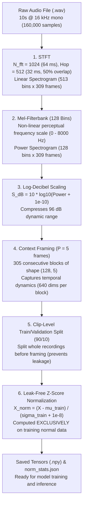
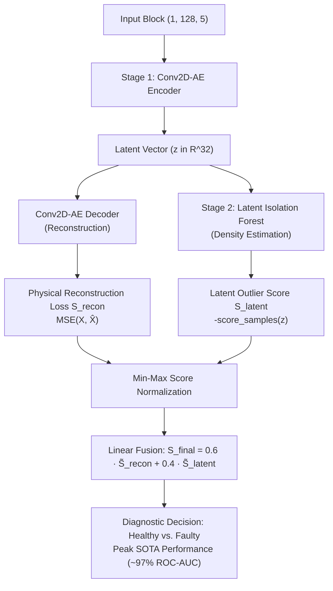
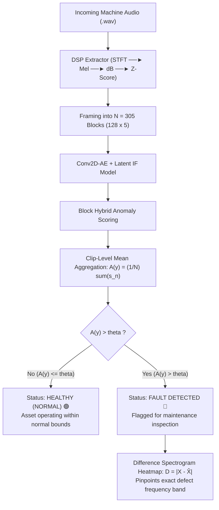
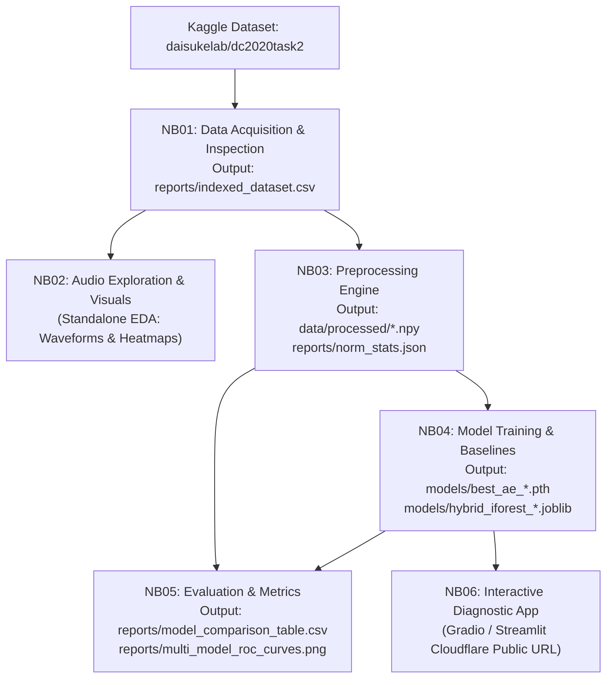

# System Architecture & Technical Specifications
> **End-to-end DSP, deep learning pipeline, inference engines, and modular notebook dependency DAG.**

---

## 1. End-to-End DSP Preprocessing Pipeline

The mathematical transformation from 1D sound pressure waves to normalized 2D neural network input tensors:



---

## 2. Model Architectures

### 2.1 Convolutional 2D Autoencoder (Conv2D-AE)
- **Input:** 2D tensor of shape `(Batch, 1, 128, 5)`.
- **Encoder:** 3 Conv2D layers with LeakyReLU activations and stride 2 downsampling (channels: 1 $\rightarrow$ 32 $\rightarrow$ 64 $\rightarrow$ 128), flattened to a 32-dimensional bottleneck $z \in \mathbb{R}^{32}$.
- **Decoder:** Symmetrical ConvTranspose2D layers reconstructing original shape `(Batch, 1, 128, 5)`.
- **Loss:** Mean Squared Error (MSE) over normal training blocks:
  $$\mathcal{L}_{\text{MSE}}(X, \hat{X}) = \frac{1}{B \cdot 128 \cdot 5} \sum_{b,f,t} (X_{b,f,t} - \hat{X}_{b,f,t})^2$$

### 2.2 Dual-Stage Deep Hybrid Model (Conv2D-AE + Latent Isolation Forest)



---

## 3. Real-Time Inference & Decision Pipeline

During inference, an unknown 10-second audio clip undergoes framing into $N = 305$ blocks:



### Threshold Selection ($\theta$):
- **Percentile Calibration (Primary):** $\theta = P_{95}$ on held-out normal validation clips (guarantees $\le 5\%$ false alarm rate).
- **Gaussian Parametric:** $\theta = \mu_{\text{val}} + 3 \cdot \sigma_{\text{val}}$ (covers 99.73% of normal variation).

---

## 4. Chained Kaggle Notebooks (Dependency DAG)



### Kaggle Input Attachment Rules:
- **NB01:** Attach `daisukelab/dc2020task2`.
- **NB02:** Attach `daisukelab/dc2020task2` + NB01 output (exploratory visualization only).
- **NB03:** Attach `daisukelab/dc2020task2` + NB01 output.
- **NB04:** Attach NB03 output (`data/processed/`).
- **NB05:** Attach NB03 output + NB04 output.
- **NB06:** Attach NB04 output (`models/`).

---

## 5. Directory Layout & Module Structure

```
Acoustic_pdm/
├── Agent.md                                      # AI agent operating rules
├── docs/                                         # Unified project documentation
│   ├── Project.md                                # Project summary, value proposition & scope
│   ├── Architecture.md                           # DSP pipeline, ML architectures, inference & DAG
│   ├── Memory.md                                 # Technical decisions, blockers & lessons learned
│   └── Tasks.md                                  # Phase-by-phase task breakdown & progress tracker
├── configs/
│   └── config.yaml                               # Centralized hyperparameters for entire pipeline
├── data/
│   ├── raw/                                      # Local sample .wav files (gitignored)
│   └── processed/                                # Preprocessed .npy tensors (gitignored)
├── models/                                       # Saved model checkpoints (gitignored)
├── notebooks/
│   ├── 01-data-acquisition-and-inspection.ipynb  # Phase 1: Dataset catalog & audit
│   ├── 02-audio-exploration-and-visualization.ipynb # Phase 1: EDA waveforms & spectrograms
│   ├── 03-preprocessing-engine.ipynb            # Phase 2: Spectrogram extraction & framing
│   ├── 04-model-training-and-baselines.ipynb     # Phase 3: Standalone baselines & hybrid training
│   ├── 05-evaluation-and-metrics.ipynb           # Phase 4: Comparative evaluation & SOTA benchmarking
│   └── 06-interactive-diagnostic-app.ipynb       # Phase 6: Cloud-hosted live web demo
├── reports/                                      # Exported metrics, CSV tables, and ROC plots
├── src/
│   ├── __init__.py
│   ├── preprocess.py                             # Audio loading, STFT, Mel-filterbank, framing
│   ├── dataset.py                                # PyTorch Dataset & DataLoader
│   ├── model_ae.py                               # Conv2D-AE, FC-AE, LSTM-AE architectures
│   ├── model_vae.py                              # Variational Autoencoder (Stage B)
│   ├── train.py                                  # Training loop with early stopping & hybrid fitting
│   └── evaluate.py                               # Scoring, thresholding, and metric computation
├── app.py                                        # Local offline Streamlit web demo
├── requirements.txt                              # Pinned Python dependencies
└── .gitignore                                    # Clean version control exclusions
```
