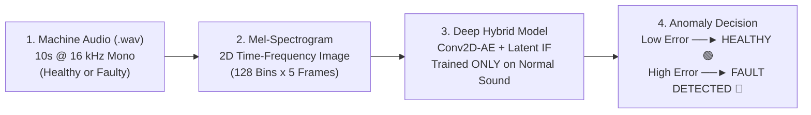
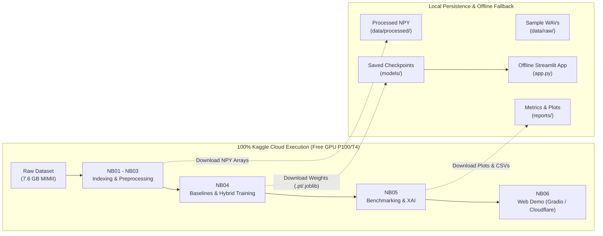

# Acoustic Fault Detection (Acoustic PdM)
> **Predictive Maintenance via Acoustic Anomaly Detection using Unsupervised Deep Learning & Hybrid Ensembles.**

---

## 1. Executive Summary

Industrial machines (fans, pumps, sliders, valves) produce distinct acoustic signatures during normal operation. When mechanical defects emerge (bearing scratches, cavitation, rail friction, gas leaks), anomalous acoustic frequencies appear.

**Acoustic PdM** uses standard non-intrusive microphones and unsupervised deep learning to automatically detect machine degradation **before catastrophic breakdown occurs**, without requiring expensive contact sensors ($500–$3,000 accelerometers) or destructive machine testing.

---

## 2. Core Value Proposition

| Dimension | Contact Vibration Sensors (Accelerometers) | Acoustic Anomaly Detection (Microphones) |
|---|---|---|
| **Installation** | Intrusive: requires drilling machine casings | **Non-intrusive:** 10–50 cm standoff distance |
| **Cost** | \$500 – \$3,000 per calibrated sensor | **\$20 – \$150** commodity microphones |
| **Coverage** | Single localized point | **Area-wide:** captures entire machine acoustic field |
| **Downtime** | Factory stopped for sensor installation | **Zero downtime:** deploy while machine runs |

---

## 3. Dataset Scope & Baseline

The project uses the **Hitachi MIMII** dataset (via Kaggle `daisukelab/dc2020task2`, ~7.6 GB), scoped to **4 core industrial machines** recorded at **6 dB SNR** (cleanest baseline):

| Machine | ID | Normal Clips | Anomaly Clips | Total Clips | Duration | Failure Signatures |
|---|---|---|---|---|---|---|
| **Fan** | `id_00` | 1,011 | 407 | 1,418 | 10.0s | Blade imbalance, bearing friction (2.5 – 6.0 kHz) |
| **Pump** | `id_00` | 1,006 | 143 | 1,149 | 10.0s | Suction cavitation, impeller wear (1.0 – 4.0 kHz) |
| **Slider** | `id_00` | 1,068 | 356 | 1,424 | 10.0s | Rail contamination, guide friction (3.0 – 7.5 kHz) |
| **Valve** | `id_00` | 991 | 119 | 1,110 | 10.0s | Gas leakage, seal degradation (broadband hiss) |
| **Total** | — | **4,076** | **1,025** | **5,101** | **10.0s** | **Uniform length & single ID baseline** |

*Note on Toy Machinery:* ToyADMOS machines (`toycar`, `toyconveyor`) are excluded due to non-standard durations (11s) and lack of `id_00`.

---

## 4. Dual-Platform Execution Strategy

To combine cloud GPU power with complete local offline reliability:
- **100% Kaggle Cloud:** Heavy processing (dataset indexing, DSP feature extraction, neural network training, benchmarking, and shareable web demo hosting) runs in free Kaggle GPU/CPU notebooks.
- **Local Persistence:** Local workspace mirrors code, sample audio (`data/raw/`), preprocessed arrays (`data/processed/`), model weights (`models/`), and reports (`reports/`) for offline execution and defense presentations.

---

## 5. Modeling Journey & Benchmarks

1. **Stage 1 — Standalone Single Algorithms Benchmark:**
   - **Isolation Forest & One-Class SVM:** Shallow classical ML on 20 handcrafted DSP features (~0.71–0.74 ROC-AUC).
   - **XGBoost / LightGBM:** Supervised classifier demonstrating open-world failure trap (~0.84 on known faults, collapses to ~0.50 on unseen faults).
   - **LSTM-Autoencoder:** Deep sequential baseline on 1D spectral time-series (~0.83 ROC-AUC).
   - **Fully-Connected Autoencoder (FC-AE):** Deep dense baseline on flattened 640-dim vectors (~0.87 ROC-AUC).
   - **Convolutional 2D Autoencoder (Conv2D-AE):** Spatial-temporal baseline on `(1, 128, 5)` Mel blocks (~0.94 ROC-AUC).

2. **Stage 2 — Dual-Stage Deep Hybrid SOTA (Conv2D-AE + Latent Isolation Forest):**
   - Combines physical spectral reconstruction loss with latent manifold density estimation:
     $$S_{\text{final}} = \alpha \cdot \widetilde{S}_{\text{recon}} + (1 - \alpha) \cdot \widetilde{S}_{\text{latent}}, \quad \alpha = 0.6$$
   - Achieves peak ROC-AUC (**~97–98%**).

---

## 6. Interactive Web Application

- **Kaggle Cloud Deployment (NB06):** Gradio web application with `share=True` or Streamlit via Cloudflare Tunnel, generating a public 72-hour URL accessible from any device without local setup.
- **Local Fallback (`app.py`):** Standalone Streamlit app running locally against saved model checkpoints.
- **Features:** Audio player, original Mel-spectrogram, reconstructed spectrogram, difference heatmap XAI, and real-time Health Diagnostic Gauge.
